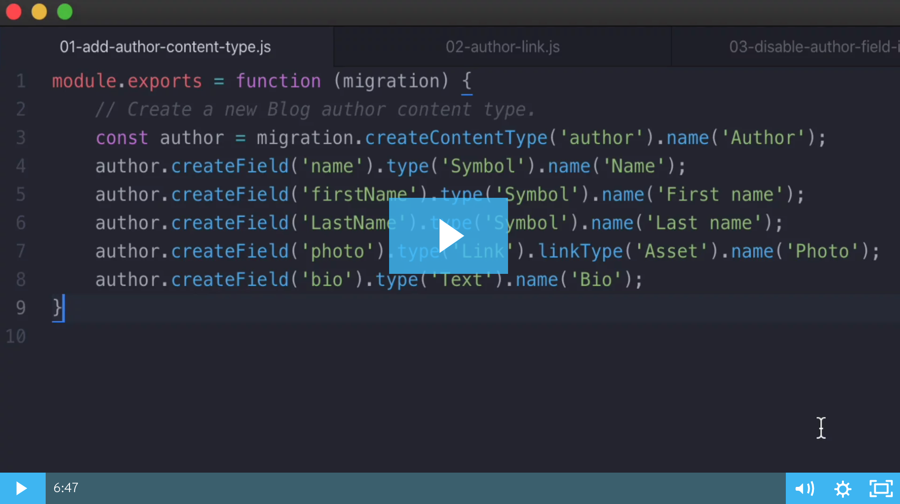

# Contentful Content Migration Examples
These scripts are used in Contentful's [Managing Content at Scale](https://public.learningcenter.contentful.com/learner/courseinfo/id:172)developer course.

To go through the example migration scripts first spin up a new PoC space and import the JSON export file using the Contentful CLI:

`contentful space import --space-id <your space id> --content-file ./contentful-exports/blog-post-example.json`

You can watch this [video](https://contentful.wistia.com/medias/889yeie6ti) to see a quick demo of the API calls.

